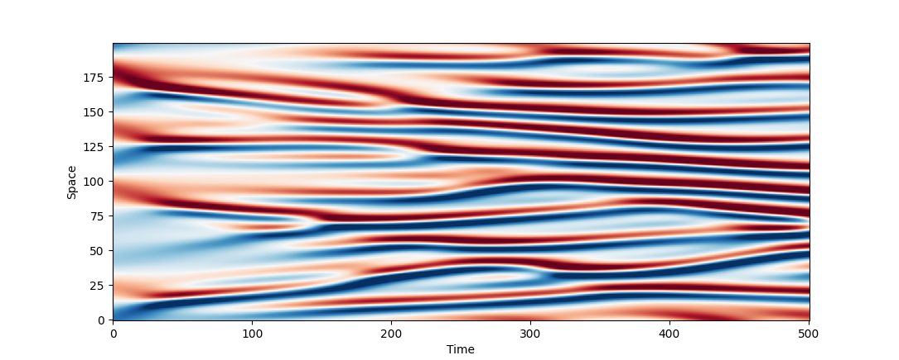

# Exponax

A suite of simple solvers for 1d PDEs on periodic domains based on exponential
time differencing algorithms, built on top of
[JAX](https://github.com/google/jax). **Efficient**, **Elegant**,
**Vectorizable**, and **Differentiable**.

### Quickstart - 1d Kuramoto-Sivashinsky equation

```python
import jax
import exponax as ex
import matplotlib.pyplot as plt

ks_stepper = ex.stepper.KuramotoSivashinskyConservative(
    num_spatial_dims=1, domain_extent=100.0,
    num_points=200, dt=0.1,
)

u_0 = ex.ic.RandomTruncatedFourierSeries(
    num_spatial_dims=1, cutoff=5
)(num_points=200, key=jax.random.PRNGKey(0))

trajectory = ex.rollout(ks_stepper, 500, include_init=True)(u_0)

plt.imshow(trajectory[:, 0, :].T, aspect='auto', cmap='RdBu', vmin=-2, vmax=2, origin="lower")
plt.xlabel("Time"); plt.ylabel("Space"); plt.show()
```



See also the *examples* folder for more. It is best to start with
`simple_advection_example.ipynb` to get familiar with the ideoms of the package,
especially if not too familiar with JAX. Then, continue with the
`solver_showcase.ipynb`. To see the solvers in action to solve a supervised
learning problem, see `learning_burgers_autoregressive_neural_operator.ipynb`. A
tutorial notebook that requires the differentiability of the solvers is in the
works.

### Features

Using JAX as the computational backend gives:

1. **Backend agnotistic code** - run on CPU, GPU, or TPU, in both single and double
   precision.
2. **Automatic differentiation** over the timesteppers - compute gradients of
   solutions with respect to initial conditions, parameters, etc.
3. Also helpful for **tight integration with Deep Learning** since each
   timestepper is also just an [Equinox](https://github.com/patrick-kidger/equinox) Module.
4. **Automatic Vectorization** using `jax.vmap` (or `equinox.filter_vmap`)
   allowing to advance multiple states in time or instantiate multiple solvers at a time that operate efficiently in batch.

Exponax strives to be lightweight and without custom types; there is no `grid` or `state` object. Everything is based on `jax.numpy` arrays.

### Background

Exponax supports the efficient solution of 1d (semi-linear) partial differential equations on periodic domains. Those are PDEs of the form

$$ \partial u/ \partial t = Lu + N(u) $$

where $L$ is a linear differential operator and $N$ is a nonlinear differential
operator. The linear part can be exactly solved using a (matrix) exponential,
and the nonlinear part is approximated using Runge-Kutta methods of various
orders. These methods have been known in various disciplines in science for a
long time and have been unified for a first time by [Cox & Matthews](https://doi.org/10.1006/jcph.2002.6995) [1]. In particular, this package uses the complex contour integral method of [Kassam & Trefethen](https://doi.org/10.1137/S1064827502410633) [2] for numerical stability. The package is restricted to original first, second, third and fourth order method. Since the package of [1] many extensions have been developed. A recent study by [Montanelli & Bootland](https://doi.org/10.1016/j.matcom.2020.06.008) [3] showed that the original *ETDRK4* method is still one of the most efficient methods for these types of PDEs.

### Built-In solvers

This package comes with the following solvers:

* Linear PDEs:
    * Advection equation
    * Diffusion equation
    * Advection-Diffusion equation
    * Dispersion equation
    * Hyper-Diffusion equation
    * General linear equation containing zeroth, first, second, third, and fourth order derivatives
* Nonlinear PDEs:
    * Burgers equation
    * Kuramoto-Sivashinsky equation
    * Korteweg-de Vries equation

Other equations can easily be implemented by subclassing from the `BaseStepper`
module.

### Other functionality

Next to the timesteppers operating on JAX array states, it also comes with:

* Initial Conditions:
    * Random sine waves
    * Diffused Noise
    * Random Discontinuities
    * Gaussian Random Fields
* Utilities:
    * Mesh creation
    * Rollout functions
    * Spectral derivatives
    * Initial condition set creation
* Poisson solver
* Modification to make solvers take an additional forcing argument
* Modification to make solvers perform substeps for more accurate simulation

### Similar projects and motivation for this package

This package is greatly inspired by the [chebfun](https://www.chebfun.org/)
package in *MATLAB*, in particular the
[`spinX`](https://www.chebfun.org/docs/guide/guide19.html) module within it. It
has been used extensively as a data generator in early works for supervised
physics-informed ML, e.g., the
[DeepHiddenPhysics](https://github.com/maziarraissi/DeepHPMs/tree/7b579dbdcf5be4969ebefd32e65f709a8b20ec44/Matlab)
and [Fourier Neural
Operators](https://github.com/neuraloperator/neuraloperator/tree/af93f781d5e013f8ba5c52baa547f2ada304ffb0/data_generation)
(the links show where in their public repos they use the `spinX` module). The
approach of pre-sampling the solvers, writing out the trajectories, and then
using them for supervised training worked for these problems, but of course
limits to purely supervised problem. Modern research ideas like correcting
coarse solvers (see for instance the [Solver-in-the-Loop
paper](https://arxiv.org/abs/2007.00016) or the [ML-accelerated CFD
paper](https://arxiv.org/abs/2102.01010)) requires the coarse solvers to be
[differentiable](https://physicsbaseddeeplearning.org/diffphys.html). Some ideas
of diverted chain training also requires the fine solver to be differentiable!
Even for applications without differentiable solvers, we still have the
**interface problem** with legacy solvers (like the MATLAB ones). Hence, we
cannot easily query them "on-the-fly" for sth like active learning tasks, nor do
they run efficiently on hardward accelerators (GPUs, TPUs, etc.). Additionally,
they were not designed with batch execution (in the sense of vectorized
application) in mind which we get more or less for free by `jax.vmap`. With the
reproducible randomness of `JAX` we might not even have to ever write out a
dataset and can re-create it in seconds!

This package took much inspiration from the
[FourierFlows.jl](https://github.com/FourierFlows/FourierFlows.jl) in the
*Julia* ecosystem, especially for checking the implementation of the contout
integral method of [2] and how to handle (de)aliasing.


### References

[1] Cox, Steven M., and Paul C. Matthews. "Exponential time differencing for stiff systems." Journal of Computational Physics 176.2 (2002): 430-455.

[2] Kassam, A.K. and Trefethen, L.N., 2005. Fourth-order time-stepping for stiff PDEs. SIAM Journal on Scientific Computing, 26(4), pp.1214-1233.

[3] Montanelli, Hadrien, and Niall Bootland. "Solving periodic semilinear stiff PDEs in 1D, 2D and 3D with exponential integrators." Mathematics and Computers in Simulation 178 (2020): 307-327.