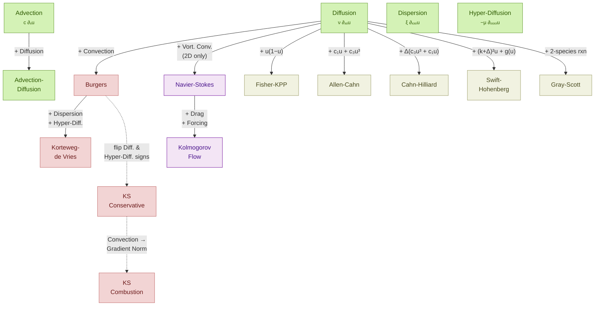
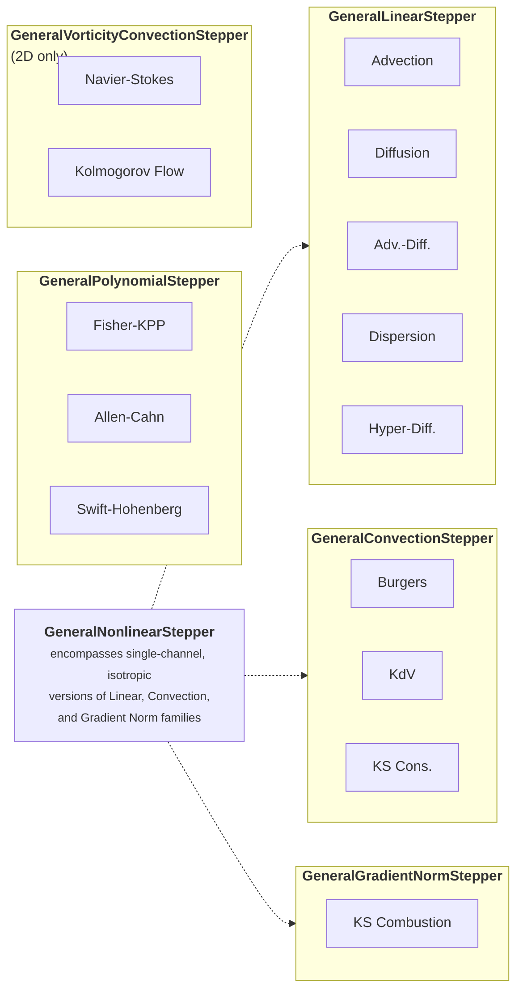

# Overview

`Exponax` comes with many pre-built dynamics. They are all based on the idea of
solving semi-linear PDEs

$$
\partial_t u = \mathcal{L} u + \mathcal{N}(u)
$$

where $\mathcal{L}$ is a linear operator and $\mathcal{N}$ is a non-linear
differential operator.

## Classification

We classify each equation/dynamic along the following properties:

- **(L)inear**: The PDE has no nonlinear term ($\mathcal{N} = 0$).
- **(N)onlinear**: The PDE includes a nonlinear term ($\mathcal{N} \neq 0$).
- **(D)ecaying**: The dynamics decay over time (energy is dissipated).
- **(I)nfinitely running**: The dynamics run indefinitely without decaying.
- **(S)teady state**: The dynamics reach a non-trivial steady state (not a
  domain-wide constant).
- **(M)ulti-channel**: The number of channels is greater than one.
- **(C)haotic**: The system is sensitive to the initial condition.

All **(L)inear** problems stay bandlimited if they start from a bandlimited
initial condition. This might be different for **(N)onlinear** problems, which
can produce higher modes and can become unresolved. This can lead to instability
in the simulation, which might require stronger diffusion or substepping.

## How the Equations Relate

The following diagram shows how the concrete PDEs in Exponax are composed from
building blocks. Diffusion is the central ingredient that appears in almost
every equation. Each arrow indicates what term is added (or changed) to obtain
a more complex equation.

## Concrete Steppers

The following table provides an overview of all concrete PDE steppers available
in Exponax. The **Class** column indicates the properties of the dynamics using
the classification above. The **Dims** column shows in which spatial dimensions
the stepper is available.

In higher spatial dimensions ($d \geq 2$), several linear steppers support
**anisotropic** variants through their parameterization. These are listed as
separate rows below. In 1D, the isotropic and anisotropic forms are identical.

| Name | Stepper | Class | Dims | Channels | 1D Equation | $d$D Equation |
|------|---------|-------|------|----------|-------------|---------------|
| [Advection](linear/advection.md) | `Advection` | L-I | 1,2,3 | 1 | $\partial_t u = - c \, \partial_x u$ | $\partial_t u = - c \vec{1} \cdot \nabla u$ |
| Unbalanced Advection | `Advection` | L-I | 2,3 | 1 | | $\partial_t u = - \vec{c} \cdot \nabla u$ |
| [Diffusion](linear/diffusion.md) | `Diffusion` | L-D | 1,2,3 | 1 | $\partial_t u = \nu \, \partial_{xx} u$ | $\partial_t u = \nu \nabla \cdot \nabla u$ |
| Diagonal Diffusion | `Diffusion` | L-D | 2,3 | 1 | | $\partial_t u = \nabla \cdot (\vec{\nu} \odot \nabla u)$ |
| Anisotropic Diffusion | `Diffusion` | L-D | 2,3 | 1 | | $\partial_t u = \nabla \cdot (A \nabla u)$ |
| [Advection-Diffusion](linear/advection_diffusion.md) | `AdvectionDiffusion` | L-D | 1,2,3 | 1 | $\partial_t u = - c \, \partial_x u + \nu \, \partial_{xx} u$ | $\partial_t u = - \vec{c} \cdot \nabla u + \nabla \cdot (A \nabla u)$ |
| [Dispersion](linear/dispersion.md) | `Dispersion` | L-I | 1,2,3 | 1 | $\partial_t u = \xi \, \partial_{xxx} u$ | $\partial_t u = \boldsymbol{\xi} \cdot (\nabla \odot \nabla \odot \nabla) u$ |
| Spatially-Mixed Dispersion | `Dispersion` | L-I | 2,3 | 1 | | $\partial_t u = \boldsymbol{\xi} \cdot \nabla(\nabla \cdot \nabla u)$ |
| [Hyper-Diffusion](linear/hyper_diffusion.md) | `HyperDiffusion` | L-D | 1,2,3 | 1 | $\partial_t u = - \mu \, \partial_{xxxx} u$ | $\partial_t u = - \mu \, ((\nabla \odot \nabla) \cdot (\nabla \odot \nabla)) u$ |
| Spatially-Mixed Hyper-Diffusion | `HyperDiffusion` | L-D | 2,3 | 1 | | $\partial_t u = - \mu \, (\nabla \cdot \nabla)(\nabla \cdot \nabla u)$ |
| [Burgers](nonlinear/burgers.md) | `Burgers` | N-D-M | 1,2,3 | $d$ | $\partial_t u = - b \frac{1}{2} \partial_x u^2 + \nu \, \partial_{xx} u$ | $\partial_t u = - b \frac{1}{2} \nabla \cdot (\mathbf{u} \otimes \mathbf{u}) + \nu \nabla \cdot \nabla \mathbf{u}$ |
| Burgers (single-channel) | `Burgers` | N-D | 2,3 | 1 | | $\partial_t u = - b \frac{1}{2} (\vec{1} \cdot \nabla) u^2 + \nu \nabla \cdot \nabla u$ |
| [Korteweg-de Vries](nonlinear/kdv.md) | `KortewegDeVries` | N-D-M | 1,2,3 | $d$ | $\partial_t u = - b \frac{1}{2} \partial_x u^2 + a_3 \, \partial_{xxx} u + \nu \, \partial_{xx} u - \mu \, \partial_{xxxx} u$ | $\partial_t u = - b \frac{1}{2} \nabla \cdot (\mathbf{u} \otimes \mathbf{u}) + a_3 \nabla(\Delta \mathbf{u}) + \nu \nabla \cdot \nabla \mathbf{u} - \mu \, \Delta(\Delta \mathbf{u})$ |
| [Kuramoto-Sivashinsky](nonlinear/ks.md) | `KuramotoSivashinsky` | N-I-C | 1,2,3 | 1 | $\partial_t u = - b \frac{1}{2} (\partial_x u)^2 - \psi_1 \partial_{xx} u - \psi_2 \partial_{xxxx} u$ | $\partial_t u = - b \frac{1}{2} \lVert \nabla u \rVert_2^2 - \psi_1 \nabla \cdot \nabla u - \psi_2 \Delta(\Delta u)$ |
| [KS (conservative)](nonlinear/ks_cons.md) | `KuramotoSivashinskyConservative` | N-I-C-M | 1,2,3 | $d$ | $\partial_t u = - b \frac{1}{2} \partial_x u^2 - \psi_1 \partial_{xx} u - \psi_2 \partial_{xxxx} u$ | $\partial_t u = - b \frac{1}{2} \nabla \cdot (\mathbf{u} \otimes \mathbf{u}) - \psi_1 \nabla \cdot \nabla \mathbf{u} - \psi_2 \Delta(\Delta \mathbf{u})$ |
| [Navier-Stokes](nonlinear/navier_stokes.md) | `NavierStokesVorticity` | N-D | 2 | 1 | | $\partial_t u = - b \left(\begin{bmatrix}1 \\ -1\end{bmatrix} \odot \nabla(\Delta^{-1} u)\right) \cdot \nabla u + \nu \nabla \cdot \nabla u$ |
| [Kolmogorov Flow](nonlinear/navier_stokes.md) | `KolmogorovFlowVorticity` | N-I-C | 2 | 1 | | $\partial_t u = - b \left(\begin{bmatrix}1 \\ -1\end{bmatrix} \odot \nabla(\Delta^{-1} u)\right) \cdot \nabla u + \lambda u + \nu \nabla \cdot \nabla u + f$ |
| [Fisher-KPP](reaction/fisher_kpp.md) | `FisherKPP` | N-S | 1,2,3 | 1 | $\partial_t u = \nu \, \partial_{xx} u + r \, u(1 - u)$ | $\partial_t u = \nu \nabla \cdot \nabla u + r \, u(1 - u)$ |
| [Allen-Cahn](reaction/allen_cahn.md) | `AllenCahn` | N-S | 1,2,3 | 1 | $\partial_t u = \nu \, \partial_{xx} u + c_1 u + c_3 u^3$ | $\partial_t u = \nu \nabla \cdot \nabla u + c_1 u + c_3 u^3$ |
| [Cahn-Hilliard](reaction/cahn_hilliard.md) | `CahnHilliard` | N-S | 1,2,3 | 1 | $\partial_t u = \nu \, \partial_{xx}(c_3 u^3 + c_1 u - \gamma \, \partial_{xx} u)$ | $\partial_t u = \nu \Delta(c_3 u^3 + c_1 u - \gamma \Delta u)$ |
| [Swift-Hohenberg](reaction/swift_hohenberg.md) | `SwiftHohenberg` | N-S | 1,2,3 | 1 | $\partial_t u = r \, u - (k + \partial_{xx})^2 u + g(u)$ | $\partial_t u = r \, u - (k + \Delta)^2 u + g(u)$ |
| [Gray-Scott](reaction/gray_scott.md) | `GrayScott` | N-S-M | 1,2,3 | 2 | | $\partial_t u_0 = \nu_0 \Delta u_0 - u_0 u_1^2 + f(1 - u_0)$; $\partial_t u_1 = \nu_1 \Delta u_1 + u_0 u_1^2 - (f + k) u_1$ |

??? note "Anisotropic and variant notes"

    - **Unbalanced Advection**: Use `Advection` with a vector `velocity` (different
      speed per spatial axis). In the isotropic case (scalar `velocity`), all
      directions use the same speed $c \vec{1} \cdot \nabla u$.
    - **Diagonal/Anisotropic Diffusion**: Use `Diffusion` (or `AdvectionDiffusion`)
      with a vector `diffusivity` for diagonal diffusion ($\vec{\nu}$) or a full
      $d \times d$ SPD matrix for fully anisotropic diffusion ($A$).
    - **Spatially-Mixed Dispersion**: Use `Dispersion(advect_on_diffusion=True)`.
      The default (`False`) computes the third-order derivative element-wise
      without spatial mixing. The mixed variant applies gradient to the Laplacian,
      introducing cross-dimensional coupling.
    - **Spatially-Mixed Hyper-Diffusion**: Use
      `HyperDiffusion(diffuse_on_diffuse=True)`. The default (`False`) computes
      the fourth-order derivative element-wise. The mixed variant applies the
      Laplacian twice, introducing spatial mixing.
    - **Burgers (single-channel)**: Use `Burgers(single_channel=True)`. The default
      multi-channel Burgers has $d$ channels growing with the spatial dimension.
      The single-channel variant keeps 1 channel regardless of dimension.
    - The `KortewegDeVries` and `KuramotoSivashinskyConservative` steppers also
      support `single_channel=True`.

## Generic Steppers

Beyond the concrete steppers, Exponax provides **generic steppers** that allow
flexibly defining a wide range of dynamics by providing arbitrary coefficients.
Each generic stepper family generalizes a group of concrete steppers by replacing
specific coefficients with arbitrary ones.

There are **three interfaces** for each generic stepper family:

1. **Physical** (`General...Stepper`): Uses physical coefficients directly.
2. **Normalized** (`Normalized...Stepper`): Coefficients are normalized based on
   domain extent and resolution for better comparability.
3. **Difficulty** (`Difficulty...Stepper`): Uses a "difficulty"-based
   parameterization relevant for learning tasks.

| Family | Nonlinearity | Channels | Dims | Concrete Special Cases |
|--------|-------------|----------|------|----------------------|
| [Linear](generic/physical/general_linear.md) | $\mathcal{N} = 0$ | 1 | 1,2,3 | Advection, Diffusion, Advection-Diffusion, Dispersion, Hyper-Diffusion |
| [Convection](generic/physical/general_convection.md) | $\frac{b}{2} \nabla \cdot (\mathbf{u} \otimes \mathbf{u})$ | $d$ (or 1) | 1,2,3 | Burgers, KdV, KS (conservative) |
| [Gradient Norm](generic/physical/general_gradient_norm.md) | $\frac{b}{2} \lVert \nabla u \rVert_2^2$ | 1 | 1,2,3 | KS (combustion) |
| [Polynomial](generic/physical/general_polynomial.md) | $\sum_i c_i u^i$ | 1 | 1,2,3 | Fisher-KPP, Allen-Cahn, Swift-Hohenberg |
| [Nonlinear](generic/physical/general_nonlinear.md) | $b_0 u^2 + \frac{b_1}{2}(\vec{1} \cdot \nabla) u^2 + \frac{b_2}{2} \lVert \nabla u \rVert_2^2$ | 1 | 1,2,3 | Combines quadratic, single-channel convection, and gradient norm |
| [Vorticity Convection](generic/physical/general_vorticity_convection.md) | $b \left(\begin{bmatrix}1 \\ -1\end{bmatrix} \odot \nabla(\Delta^{-1} u)\right) \cdot \nabla u$ | 1 | 2 | Navier-Stokes, Kolmogorov Flow |

All generic steppers (except vorticity convection) combine their respective
nonlinearity with an arbitrary number of **isotropic** linear terms:

$$
\mathcal{L} u = \sum_j a_j (\vec{1} \cdot \nabla)^j u
$$

Note that the generic steppers only support the isotropic linear operator. For
anisotropic linear dynamics, use the concrete steppers with their respective
anisotropic parameterizations (see table above).
